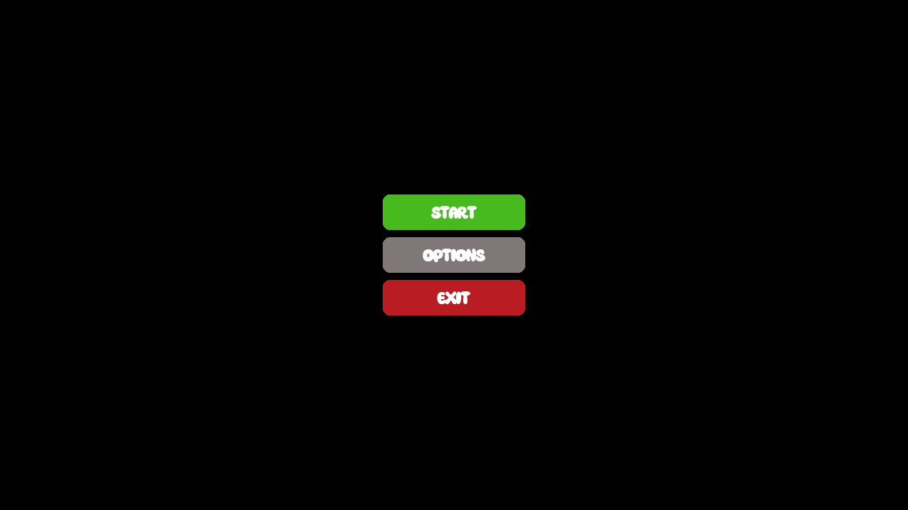
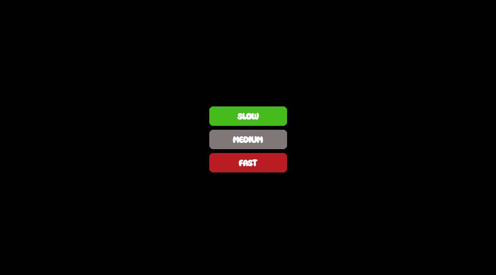
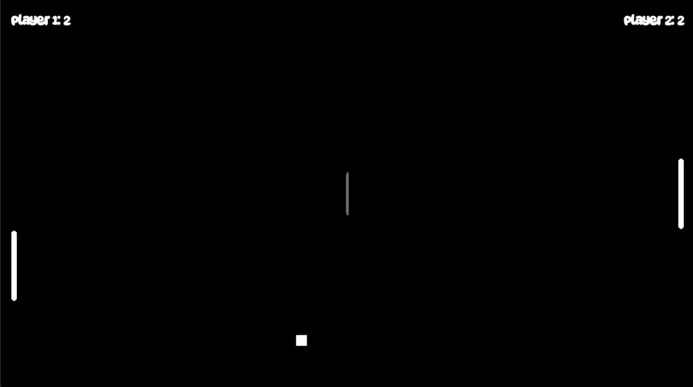

# Pong Game

This project is an implementation of the classic Pong game using the Lua programming language and the LÖVE (Love2D) game engine.

## Installation

1. First, install the LÖVE (Love2D) game engine on your computer. You can download it from the [Love2D Download Page](https://love2d.org/).

2. Clone this repository to your computer:

    ```bash
    git clone https://github.com/erblgc/pong-game.git
    ```

3. Navigate to the cloned directory:

    ```bash
    cd pong-game
    ```

4. To start the game, run the following command in the terminal:

    ```bash
    love .
    ```

## Controls

- Player 1:
  - Up: `W`
  - Down: `S`

- Player 2:
  - Up: `Up Arrow`
  - Down: `Down Arrow`

- Pause Game: `ESC`

## Screenshots
### Start Menu


### Difficulty Menu


### In-Game


### Game Over


## Development

- Recommended IDE for development: Visual Studio Code
- ### Options
Enhance your gaming experience with customizable options! Here are some ideas for further development:

- **Design Selection:** Allow players to choose from a variety of visual themes for the game.
- **Dynamic Music:** Implement a feature that enables players to select and change the in-game music.
- **Speed Control:** Introduce a slider or toggle to adjust the game speed according to player preferences.
- **Advanced Settings:** Create an advanced settings menu where players can fine-tune various aspects of the game.

Feel free to explore these suggestions and implement features that will make the game even more enjoyable and customizable for players!


